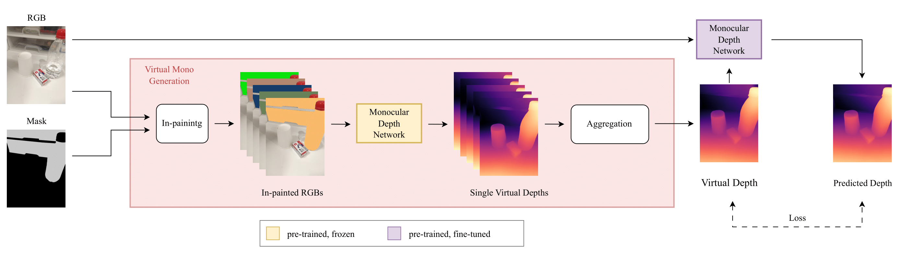
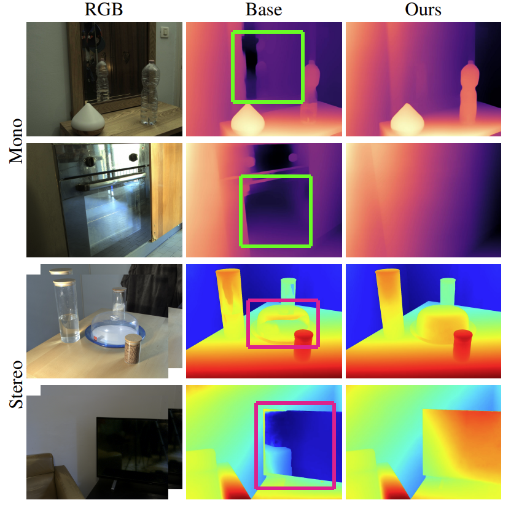

<h1 align="center"> Learning Depth Estimation for Transparent and Mirror Surfaces (ICCV 2023) </h1> 


<br>

:rotating_light: This repository contains download links to our dataset, code snippets, and trained deep models of our work  "**Learning Depth Estimation for Transparent and Mirror Surfaces**",  [ICCV 2023](https://cvpr2023.thecvf.com/)
 
by [Alex Costanzino*](https://www.unibo.it/sitoweb/alex.costanzino), [Pierluigi Zama Ramirez*](https://pierlui92.github.io/), [Matteo Poggi*](https://mattpoggi.github.io/), [Fabio Tosi](https://fabiotosi92.github.io/), [Stefano Mattoccia](https://www.unibo.it/sitoweb/stefano.mattoccia), and [Luigi Di Stefano](https://www.unibo.it/sitoweb/luigi.distefano).  \* _Equal Contribution_

University of Bologna


<div class="alert alert-info">


<h2 align="center"> 

[Project Page](https://cvlab-unibo.github.io/Depth4ToM/) | [Paper](https://arxiv.org/abs/2307.15052)
</h2>


## :bookmark_tabs: Table of Contents

1. [Introduction](#clapper-introduction)
2. [Dataset](#file_cabinet-dataset)
   - [Download](#arrow_down-get-your-hands-on-the-data)
3. [Pretrained Models](#inbox_tray-pretrained-models)
4. [Code](#memo-code)
5. [Qualitative Results](#art-qualitative-results)
6. [Contacts](#envelope-contacts)

</div>

## :clapper: Introduction
Inferring the depth of transparent or mirror (ToM) surfaces represents a hard challenge for either sensors, algorithms, or deep networks. We propose a simple pipeline for learning to estimate depth properly for such surfaces with neural networks, without requiring any ground-truth annotation. We unveil how to obtain reliable pseudo labels by in-painting ToM objects in images and processing them with a monocular depth estimation model. These labels can be used to fine-tune existing monocular or stereo networks, to let them learn how to deal with ToM surfaces. Experimental results on the Booster dataset show the dramatic improvements enabled by our remarkably simple proposal.

<h4 align="center">

</h4>



:fountain_pen: If you find this code useful in your research, please cite:

```bibtex
@inproceedings{costanzino2023iccv,
    title = {Learning Depth Estimation for Transparent and Mirror Surfaces},
    author = {Costanzino, Alex and Zama Ramirez, Pierluigi and Poggi, Matteo and Tosi, Fabio and Mattoccia, Stefano and Di Stefano, Luigi},
    booktitle = {The IEEE International Conference on Computer Vision},
    note = {ICCV},
    year = {2023},
}
```

## :file_cabinet: Dataset

In our experiments, we employed two datasets featuring transparent or mirror objets: [Trans10K](https://xieenze.github.io/projects/TransLAB/TransLAB.html) and [MSD](https://mhaiyang.github.io/ICCV2019_MirrorNet/index). With our in-painting technique we obtain virtual depth maps to finetune monocular networks. For sake of reproducibility, we make available Trans10K and MSD together with proxy labels used to finetune our models.

### :arrow_down: Get Your Hands on the Data
Trans10K and MSD with Virtual Depths. [[Download]](https://1drv.ms/u/s!AgV49D1Z6rmGgZAz2I7tMepfdVrZYQ?e=jbuaJB)

We also employed the Booster Dataset in our experiment. [[Download]](https://cvlab-unibo.github.io/booster-web/)

## :inbox_tray: Pretrained Models

Here, you can download the weights of **MiDAS** and **DPT** architectures employed in the results of Table 2 and Table 3 of our paper. If you just need the best model, use `"Table 2/Ft. Virtual Depth/dpt_large_final.pt`

To use these weights, please follow these steps:

1. Create a folder named `weights` in the project directory.
2. Download the weights [[Download]](https://1drv.ms/u/s!AgV49D1Z6rmGgZAyTbFLjjTMdgsE_A?e=1xcf4y)
3. Copy the downloaded weights into the `weights` folder.

## :memo: Code

<div class="alert alert-info">

**Warning**:
- Please be aware that we will not be releasing the training code for deep stereo models. We provide only our algorithm to obtain proxy depth labels by merging monocular and stereo predictions.
- The code utilizes `wandb` during training to log results. Please be sure to have a wandb account. Otherwise, if you prefer to not use `wandb`, comment the wandb logging code lines in `finetune.py`.

</div>


### :hammer_and_wrench: Setup Instructions

**Dependencies**: Ensure that you have installed all the necessary dependencies. The list of dependencies can be found in the `./requirements.txt` file.


### :rocket: Inference Monocular Networks

The `run.py` script test monocular networks. It can be used to predict the monocular depth maps from pretrained networks, or to apply our in-painting strategy of Base networks to obtain Virtual Depths.

You can specify the following options:
   - `--input_path`: Path to the root directory of the dataset. E.g., _Booster/balanced/train_ if you want to test the model on the training set of Booster.
   - `--dataset_txt`: The list of the dataset samples. Each line contains the relative path to `input_path` of each image. You can find some examples in the folder _datasets/_. E.g., to run on the training set of booster use *datasets\booster\train_stereo.txt*
   - `--mask_path`: Optional path with the folder containing masks. Each mask shoud have the same relative path of the corresponding image. When this path is specified, masks are applied to colorize ToM objects.
   - `--cls2mask`: IDs referring to ToM objects in masks.
   - `--it`: Number of inferences for each image. Used when in-painting with several random colors.
   - `--output_path`: Output directory,
   - `--output_list`: Save the prediction paths in a txt file.
   - `--save_full_res`: Save the prediction at the input resolution. If not specified save the predictions at the model output resolution.
   - `--model_weights`: Path to the trained weights of the model. If not specified load the Base network weights from default paths.
   - `--model_type`: Model type. Either `dpt_large` or `midas_v21`.

You can reproduce the results of Table 2 and Table 3 of the paper by running `scripts/table2.sh` and `scripts/table3.sh`.

If you haven't downloaded the pretrained models yet, you can find the download links in the **Pretrained Models** section above.

### :rocket: Train Monocular Networks

To finetune networks refer to the example in `scripts/finetune.sh`

### :rocket: Monocular Virtual Depth Generation

To generate virtual depth from depth networks using our in-paiting strategy refer to the example in `scripts/generate_virtual_depth.sh`

### :rocket: Stereo Proxy Depth Generation

To generate proxy depth maps with our merging strategy to finetune stereo networks you can use `create_proxy_stereo.py`. 

As explained above, we will not release the code for finetuning stereo networks. However, our implementation was based on the official codes of [RAFT-Stereo](https://github.com/princeton-vl/RAFT-Stereo) and [CREStereo](https://github.com/megvii-research/CREStereo).

## :art: Qualitative Results

In this section, we present illustrative examples that demonstrate the effectiveness of our proposal.

<p float="left">

</p>

## :envelope: Contacts

For questions, please send an email to alex.costanzino@unibo.it, pierluigi.zama@unibo.it, m.poggi@unibo.it, or fabio.tosi5@unibo.it

## :pray: Acknowledgements

We would like to extend our sincere appreciation to the authors of the following projects for making their code available, which we have utilized in our work:

- We would like to thank the authors of [MiDAS](https://github.com/isl-org/MiDaS), [RAFT-Stereo](https://github.com/princeton-vl/RAFT-Stereo) and [CREStereo](https://github.com/megvii-research/CREStereo) for providing their code, which has been instrumental in our experiments.

We deeply appreciate the authors of the competing research papers for their helpful responses, and provision of model weights, which greatly aided accurate comparisons.